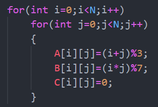

## Summary of Matrix Optimization
#### 涉及模块：C language，AVX指令集，openmp模型
#### 测试规模：double型 2048 x 2048的方阵，即N=2048
#### 衡量标准：cup time，parallel time ... time单位：s（秒）
#### 优化目标：在第一个版本的基础上提升...倍

---
## 模块一（基础优化,one.c文件）
0. 初始化过程

1. 未优化模型

**此模型未进行任何友好优化，在intel编译器下使用Od参数禁用编译器优化后进行编译，得到结果为time：307.130000秒的巨长时间**
2. 稍微提高cache命中率优化

**仔细观察这份代码的改变，对于之前的那份而言，B数组按照列访问改为按照行访问在此提高了cache命中率，但是对于数组A而言之前的按行访问变为按列访问，在此减小了命中率，不过把A从最内层循环提出来也大大减少对A的访存，相对命中率来说是一种折衷。在intel编译器下使用Od参数禁用编译器优化后进行编译，得到结果为time：32.210000秒，OK 提升了几乎10倍，继续...**
3. 流行的分块思想，在对cache命中率进行提高

**更多的循环，更正代码画图即理解，此优化对bsize的选取要求很高，若大了则导致分块大，达不到提高cache命中率的目的，若小了注意会发送伪共享问题，更具测试数据量此处选取16比较合适，最终time=30.210000秒，OKOK，提高几乎不计，可能是数据量导致优化效果差，可以适当提高N尝试。**
4. 通过转置进行提高命中率

**转置后的矩阵B，以及之前的A都是按照行进行访问，对cache是友好的，不过对于转置的过程是有巨大开销的，此处未对矩阵转置进行任何的优化，在经过转置优化后性能会得到提升，不过此处的热点依然是矩阵的乘法，测试time=36.139000秒。**
#### 到目前为止，常见的优化就结束了，以上几种优化表现好的可以达到10倍的性能提升，不过，继续...
## 模块二（以如AVX指令集，细粒度并行）
1. 对转置矩阵进行AVX优化

**矩阵转置后按照行进行访问，所以天然适合向量形式运算，把焦点集中在内层for循环，t1每次加载A矩阵4个double元素，t2加载B，类加乘的结果放在sum中，其中sum是含有4个元素的向量，为此最终结果需要在进行累加，当变量为float时可以用注释掉的3条指令代替list数组的累加，现在为double的指令还未找到，接下来的for处理剩余元素。OK 测试time：19.754000秒，到此提升300/20=15倍左右了**
2. 对分块矩阵使用AVX指令进行优化

**实现思想可以参考上一个版本的改编，看看time：22.709000秒，同级别下相差不大，同样可以达到原版本的15倍提升。**
#### OK now 我们已经在原来基础上提高了15倍，看看所做的工作，在模块二的所有提升中为了实现向量化都需要对矩阵进行转置，而对于转置的过程并未进行优化，此处有提升的空间。接下来就是优化的方向选取，一是进行粗粒度的并行优化，再者就是继续对访存进行深度优化，在进行粗粒度并行，为了有更大的提高空间，我继续在模块一的基础上优化访存。
## 模块三 （深度了解访存，最大限度使用寄存器）
**最大限度的优化缓存，在此部分既然需要追求极致访存速度，对代码的可读性等方面必然导致大幅度下降，为此每一部分的代码借助画图可以加深理解。首先，这部分的代码实现可以说是之前分块乘法的细粒度版本，不仅仅对矩阵的分块更加合理，而且对数据精细的打包技术使得在访存方面不仅仅提高的是cache命中率，而且对x86系统没一个寄存器的使用都做到极致。（首先在硬件方面需要了解的是我们的系统一共有16个寄存器可以使用，若是别的数量可以仿照进行编码）**

- 数据打包
根据硬件平台16个寄存器，可以分解为4x4的方式进行矩阵相乘。为此考虑对矩阵B的列进行打包，每次四列，每列长度为N的形式得到一个package二维数组（这样打包的形式是考虑到对数组B的访问将按照列访问转为行访问），最后使用package与数组A的四行进行相乘即可得到结果C矩阵（此处循环N/4次，注意最后剩余结果的处理）。这种对方正B的打包方式如下图：


- 主体代码
此部分比较难以理解的是内部循环对deal函数的调用，之前说过对B进行数据提取到package中，而如何对16个寄存器进行调用则直接体现在deal函数的调用，通过灵活变化参数col（后面会有提到）


- deal函数
先上代码，在上几张图应该就可以理解


**对于这巨多的指针不画画图很难理解，首先看几个初始变量：图中各个变量的大体意义已经标注，其中package之前说过是从B矩阵4列4列（j变量）的取出来的**

**下面这张图解释的是在while循环中各个寄存器t如何进行计算累加乘的过程（此处仅仅展示三个寄存器，其他的类似）**

**明白了图中的寄存器调用也就明白了如何对方阵C进行赋值。最后回到主体代码中的for循环对deal函数的调用，现在应该很清楚了，其中j=col，i=row，且i，j+=4；在遍历完N长度后乘法也就相应完成了。看看运行时间：time= 9.284000秒！粗略估计一下，提高了300/10=30倍，虽然到此为止代码的可读性差到极致，但获得这种巨大的提升是值得的。**

- 后处理
大致的编码工作已经完成，但是在回过头来看我们的代码，似乎有所缺陷，首先来看看N的取值，N=2*1024，在看看我们寄存器的数量：4 *4=16；最后来看我们每一次对矩阵B进行打包的包大小package.length=4;OK,漏洞找到了，N的值如果不能整除package.length的话会有不可预测的后果，而我们的编码中对这种处理并未进行体现。接下来进行测试分析看看代码结构：
首先将N的值缩小到5以方便测试，不过在测试过程中发现无论N的值是否可以整除package.length的大小，其最后的结果是正确的，我们来刨析代码可以发现在片段中（此处取N=5）：
```
 for(i=0;i<N;i++)
        {
            if(N>=4)
                {
                    printf("B[%d][%d+3]:%f\n",i,j,B[i][j+3]);
                }
            package[0][i]=B[i][j];
            package[1][i]=B[i][j+1];
            package[2][i]=B[i][j+2];
            package[3][i]=B[i][j+3];
        }
```
打印的结果为B[3][4+3]:2.000000 and B[4][4+3]:0.000000；OK，B的length最大为5，这里下标却用到了7，我们暂时保留这个错误，因为此处对B[4][7]的越界数组值仅仅是读操作，危害不大。我们再来看看何处使用到package这一隐藏的错误之处-----deal函数，在deal函数中使用package比较危险的地方为代码段：
```
        C[col][row]=t0;
        C[col+1][row]=t1;
        C[col+2][row]=t2;
        C[col+3][row]=t3;
        C[col][row+1]=t4;
        C[col+1][row+1]=t5;
        C[col+2][row+1]=t6;
        C[col+3][row+1]=t7;
        C[col][row+2]=t8;
        C[col+1][row+2]=t9;
        C[col+2][row+2]=t10;
        C[col+3][row+2]=t11;
        C[col][row+3]=t12;
        C[col+1][row+3]=t13;
        C[col+2][row+3]=t14;
        C[col+3][row+3]=t15;
```
此处是对数组C进行写如，仔细看回发现对C进行写的过程中有越界的操作，而那些越界的步骤刚好就是package数组中越界非法步骤计算的出来的结果，所以理论上并不影响最终C的结果。不过这种越界的写操作对程序是一种潜在威胁，若要改进可以对以上两个代码片段加如分支进行判断是否越界，但性能会有所下降。当然还有一种办法对N进行分配，对于N可以整除package.length的部分依然采取如上办法，对于不能整除的部分，为每一部分定制一份deal代码即可，但这样做的后果就直接导致巨大的代码量。

上图中取： en=（N/4）*4，假设剩余未3的效果图，图中每一次计算C的过程用黄色，红色框出。所以需要为剩余的3定制三分deal代码，每一份采用不同的寄存器。
**ok现在我们的访存优化似乎到极致了，到此也获得了30倍左右的提升，不过之前使用过的AVX指令集适合对向量操作，而我们的package又可以看做向量的集合，为此继续优化，把cup使用到极致**

##模块四（AVX+刚才的极致访存）
- 预知识
__m256d:一个能够存储4个double的向量
其他avx指令集函数；
- 数据打包处理package
为了充分利用向量的运算特点，即一次处理4个数字，为此设计一个专门的package是必要的，此部分像前一部分package构造类似，不过更为复杂，我们使用一个二维数组package来对B矩阵打包，同样按照列来取，不过更具向量的运算一次4个的特征进行构造，下图是我们的构造：

其对应的主要代码：
```
    double *package[2];
    package[0]=(double*)malloc(sizeof(double)*N*4);
    package[1]=(double*)malloc(sizeof(double)*N*4);
    for(int j=0;j<N;j+=8)
    {
        int k=0,i=0;
        do{
            package[0][k]=B[i][j];
            package[1][k++]=B[i][j+4];
            package[0][k]=B[i][j+1];
            package[1][k++]=B[i][j+5];
            package[0][k]=B[i][j+2];
            package[1][k++]=B[i][j+6];
            package[0][k]=B[i][j+3];
            package[1][k++]=B[i++][j+7];
        }while(i<N);
        for(int col=0;col<N;col+=4)
            deal(package,j,col);
    }
```
对于这种构造方式使用两个package的原因是cache足够大（也可以使用一个，甚至多个，你机器厉害），回到package的构造，图中说的已经很清楚了，相比于之前的构造这次对B中每一列中包含4小列（红椭圆）对应于向量运算。对于构造出的package同样和之前的版本一样交给deal函数。

- deal函数

又是巨长的代码，要理解她还得看看下面得解析图：

来解释一下上图：首先package[0],package[1]是从B矩阵一列一列的打包打出来的，在来看看几个向量，对于a0来说，它在package[0]中移动，a1类似；对于b0来说它在矩阵A的第一行中运动，首先它取A[0][0]的值赋给向量b0中的4个元素（所以b0中的元素全是一样的），当执行pb0++时，则取A[0][1]的值对b0向量进行赋值；pb1，pb2，pb3类似；接下来我们来看看vec_i向量中存放的值是什么，对于vec_1来说，他是a0，b0及自身累加乘的结果，这里便于理解首先把a0理解为扫描package[0]中的元素按照4个一组执行，b0理解为扫描A矩阵中第一行的每一个元素按照1个一组执行，所以累乘的结果写开（a0[0]*b0,a0[1]*b0,a0[2]*b0,a0[3]*b0）,此处因为b0中4个元素值都一样就简写b0；那么现在就很好理解了，效果就是B中的第一列与A中第一行每一个元素相乘（此处是下标对于元素相乘）并累加的和放在vec_1[0]中，B中的第二列与A中第一行每一个元素相乘（此处是下标对于元素相乘）并累加的和放在vec_1[1]中...为此vec_1中的结果就是C中前四个元素的值。在此就实现了一次计算4个元素的目标，而我们选取的package是2个，所以一次计算C中的元素可以到达8个。最后回到主代码的for循环调用deal函数：
```
 for(int col=0;col<N;col+=4)
            deal(package,j,col);
```
如果理解了之前的叙述，在来看for，这里就是对整个B,A的分块计算。我们再来看看他的运行时间 time= 7.986000秒，相比之前下降2秒，虽然效果不是太惊人，但是现阶段已经很不错了，至此对于AVX实现这一版本的矩阵乘依然存在上一版本所说的乱写问题（N不能整除package.length）,这里先放着，以后在改。好在看看代码层面还有什么可以改的。

- 字节对齐
据说字节对齐之后可以提高访存速度，so试一试。首先修改数组的定义：
```
#pragma pack(16)//16字节对齐
double A[N][N];
double B[N][N];
double C[N][N];
#pragma pack()
```
然后在deal函数中修改avx指令，使用字节对齐的相关指令，修改后的函数在deal2中，最后测试：time=8.182000秒，区别不大，可能是数据量的原因，不过字节对齐确实有利于访存是一个事实。我们的优化工作已经差不多了，对于单核cpu的性能几乎达到极致，接下来的一部分工作我们交给intel或gcc编译器，然他帮我在优化优化。


##模块五（编译器优化）
**之前所有模块中我们都已Debug的方式进行测试，这意味着我们对编译器的自动优化采取了禁用模式，现在我们来开启编译器的各种优化，看看可以在当前最快的版本之上又可以提高多少性能。首先这里先列举出我已知可以优化的项，针对intel编译器，gcc类似:**

- 几个通用优化选项
Od：不做优化（我们之前采用的）
O1：优化速度及代码长度，开启部分向量化优化
O2：优化运行速度，开启过程间优化
O3：进一步优化，最高级别

- 增加过程间优化IPO
Qipo<n>

- 性能测评指导优化PGO
-prof-gen
-prof-use
此优化需要收集信息进行获取先验知识以获得最终的优化结果（此次我们的工作不采用这种优化）

**我们使用O3最高级别和IPO进行简单的编译器自动优化，最终TIME=0.640000秒，好了又提高了一个数量级，直接提升了300/0.64=468倍！注意我优化的顺序，在做完访存优化后的所有工作之后才进行编译器层次的优化，这样取得的效果比较好。至此我们基本达目标，接下来我们把它交给多核去处理来追求极致速度。**

##模块六（粗粒度并行优化）
- 使用模型：openmp进行简单的并行，以任务并行的方式进行动态分配，最大限度提高cup利用率。
- 代码段：
```
#pragma omp parallel for schedule(dynamic)
    for(int j=0;j<N;j+=8)
    {
        int k=0,i=0;
          do{
            package[0][k]=B[i][j];
            package[1][k++]=B[i][j+4];
            package[0][k]=B[i][j+1];
            package[1][k++]=B[i][j+5];
            package[0][k]=B[i][j+2];
            package[1][k++]=B[i][j+6];
            package[0][k]=B[i][j+3];
            package[1][k++]=B[i++][j+7];
          }while(i<N);
        for(int col=0;col<N;col+=4)
            deal(package,j,col);
    }
}
```
从以上代码分析，我们把j循环分配给不同的核，首先对package分析，可以发现这是一个共享变量，在运行过程中并不会产生数据冲突，所以放心使用即可，不过以上代码有待调优，应为经过测试cpu使用率仅仅达到40%多左右，不过测试时间已经可以了time=0.392000秒，当然如果你电脑核够多可以多分配几个核可以减更多时间（我们仅仅分配4个线程，分配更多核时意味着面临更低cpu使用率，需要你更细粒度的调试才能获得好结果）。
**so 最终我们的结果可以大致总结一下：300秒/0.3秒=1000倍。**


